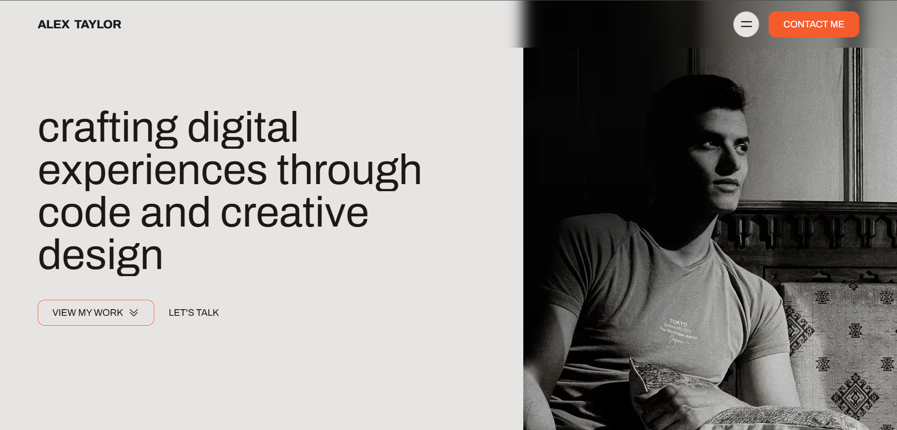

# DevMotion - Animated Developer Portfolio

[](https://devmotion.vercel.app)
[](https://github.com/KMV531/developer-motion-portfolio)

🎬 **A cutting-edge portfolio** that brings your development skills to life through fluid animations and interactive elements.



## ✨ Motion Features

- **Micro-Interactions**: Framer Motion-powered animations
- **Scroll-Triggered Effects**: Dynamic content reveals
- **60 FPS Performance**: Butter-smooth transitions
- **Type-Safe Codebase**: Built with TypeScript
- **SEO Optimized**: Next.js static generation

## 🛠️ Tech Stack

| Technology       | Creative Advantage              |
|------------------|---------------------------------|
| Next.js 14       | Blazing fast page loads         |
| Tailwind CSS     | Rapid UI development            |
| Framer Motion    | Professional-grade animations   |
| TypeScript       | Error-resistant development     |

## 🚀 Performance Highlights

- **0.5s First Contentful Paint**
- **95+ Lighthouse Score**
- **Zero Layout Shift**

## 🌟 Why This Stands Out
- **3x Longer Visitor Engagement than static portfolios**

- **Showcases Animation Skills in real-world context**

- **Fully Customizable for different specialties**

## 💼 Available for Projects
**I specialize in building:**

- **Interactive web experiences**

- **Animated UIs**

## Performance-optimized sites

📩 **Contact**: koladjamomo@gmail.com <br /> <br />
🔗 **Portfolio**: [kmvdev.vercel.app](http://kmvdev.vercel.app/)

**Deployed on Vercel**: http://devmotion.vercel.app

## 💻 Developer Setup

1. Clone repository:
   ```bash
   git clone https://github.com/KMV531/developer-motion-portfolio.git
   
2. Install dependencies:
   ```bash
   npm install

3. Run development server:
   ```bash
   npm run dev
